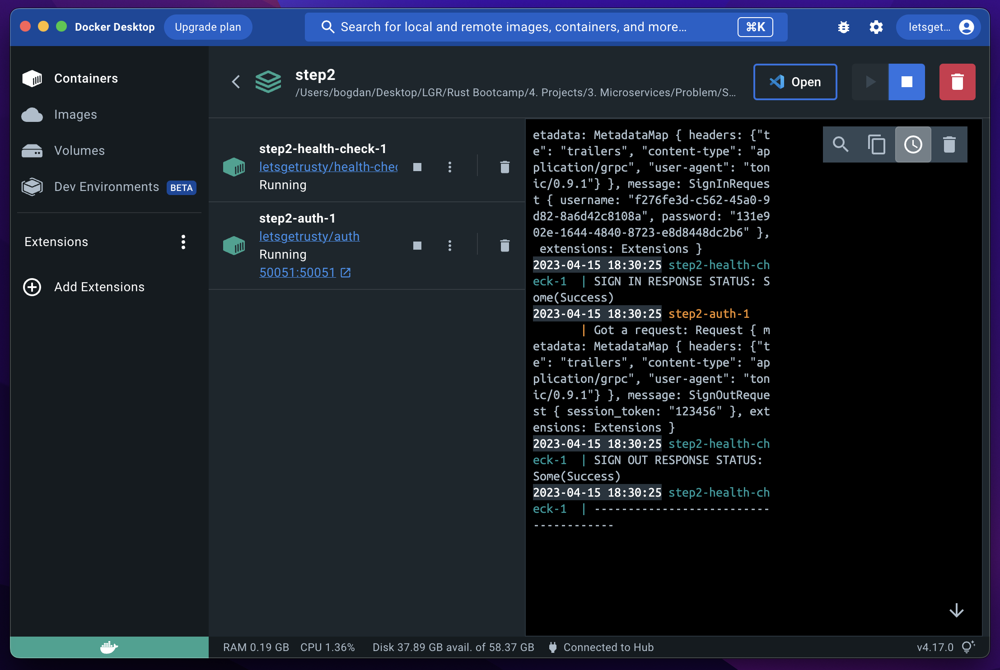

# StackOverflow API

## Description

This is an educational project to learn RUST. The goal is to create a build a microservice app consisting of 2 services, an authentication service and a health check service, and a client that can communicate with the auth service.

Project requirements are listed in [RUST bootcamp repo](https://github.com/letsgetrusty/bootcamp/blob/master/4.%20Projects/3.%20Microservices/Problem/README.md).

